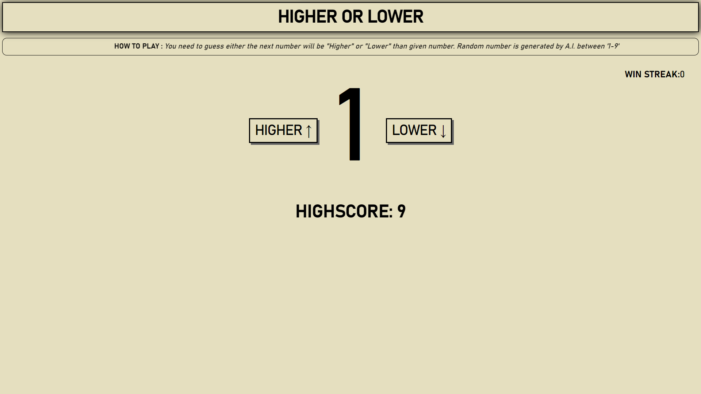
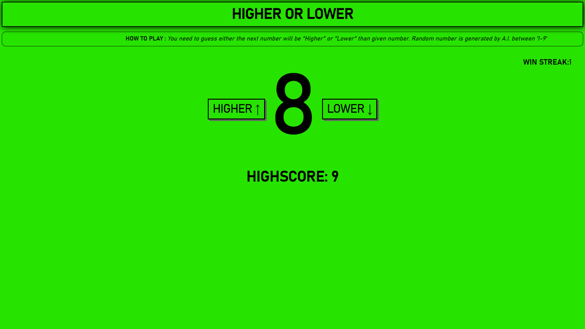
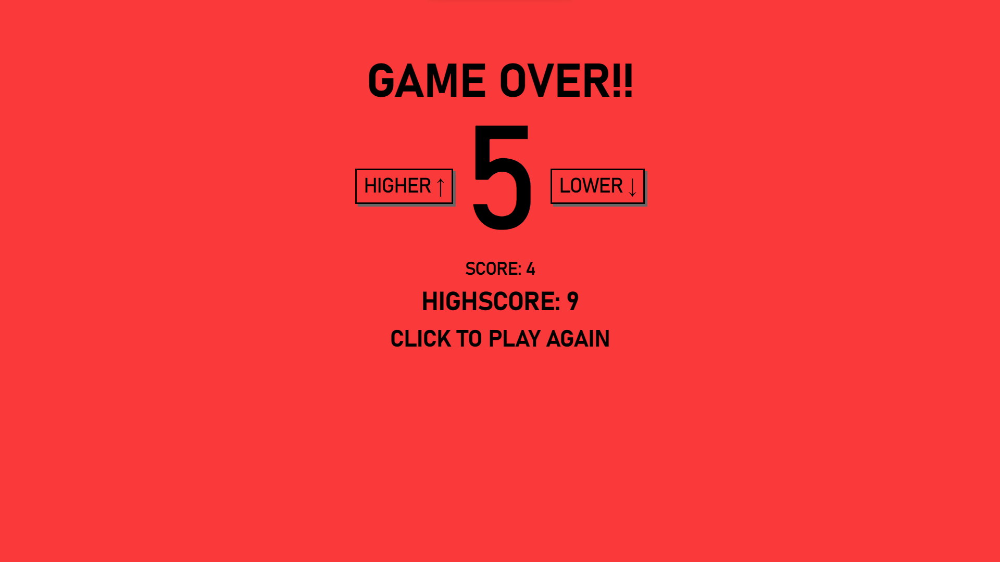

# What is Higher Or Lower ?
HigherOrLower is a guessing game where players need to guess whether the next number will be higher or lower than the currently showed number in the screen. Numbers will be randomly generated between 1 - 9. It also has the feature of Highscore where it saves the highest score in the localStorage and display it on the site. Try and beat the Highscore. Lets go!!!

